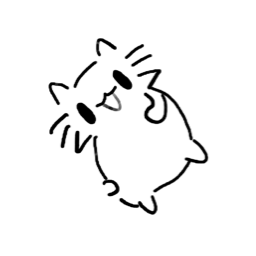
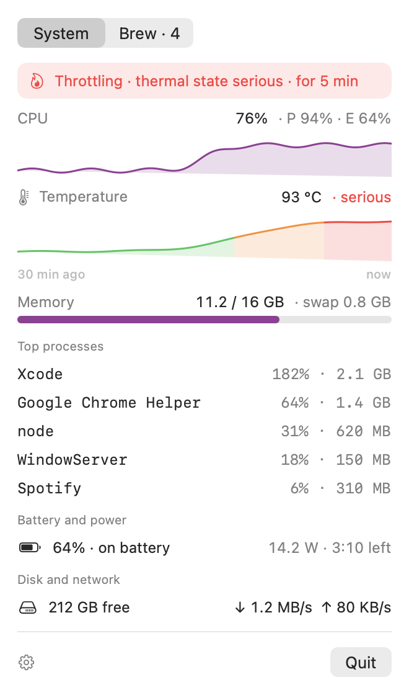
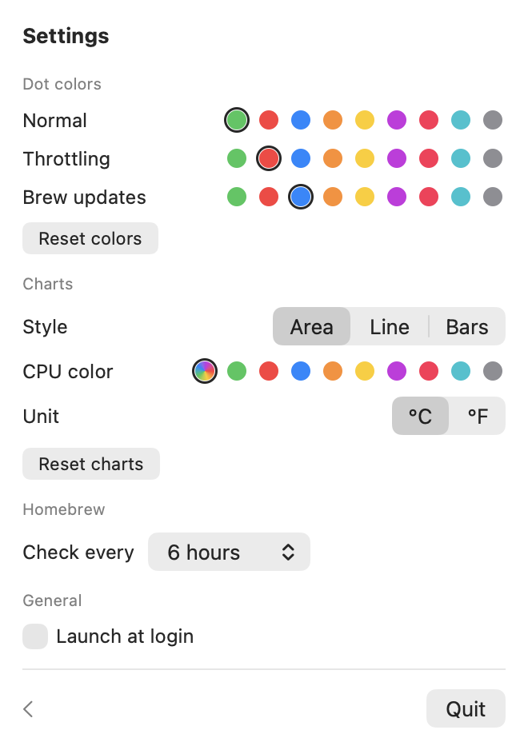
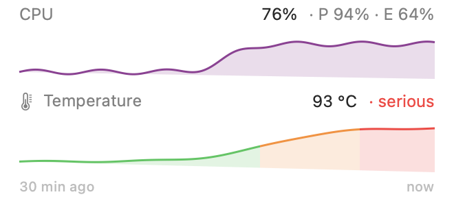
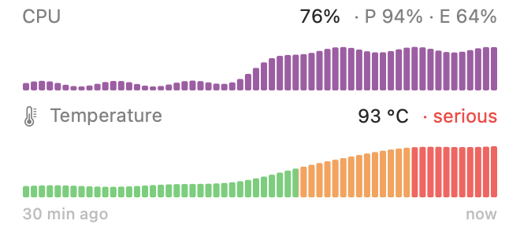

<p align="center"></p>

# MacVitals

A small menu bar app for MacBooks, built for fanless Airs. It shows system load, tells you when macOS starts thermal throttling, and lists pending Homebrew updates.

MacBook Airs have no fan. Under sustained load, such as a long build, a video export or a pile of browser tabs, the chip heats up and macOS quietly lowers its speed to cool it down. Everything keeps working, just slower, and nothing tells you. MacVitals sits in your menu bar as a small cat with a colored status dot. The dot turns red as soon as macOS starts throttling, and the dashboard shows you what caused it. It also keeps an eye on Homebrew, so you know when updates are waiting.

<table>
  <tr>
    <td align="center" valign="top">
      <picture>
        <source media="(prefers-color-scheme: dark)" srcset="docs/screenshots/v3/system-dark.png">
        
      </picture>
    </td>
    <td align="center" valign="top">
      <picture>
        <source media="(prefers-color-scheme: dark)" srcset="docs/screenshots/v3/brew-dark.png">
        
      </picture>
    </td>
    <td align="center" valign="top">
      <picture>
        <source media="(prefers-color-scheme: dark)" srcset="docs/screenshots/v3/settings-dark.png">
        
      </picture>
    </td>
  </tr>
  <tr>
    <td align="center">System</td>
    <td align="center">Brew</td>
    <td align="center">Settings</td>
  </tr>
</table>

<sub>Screenshots use demo data, rendered with <code>--snapshot --demo</code>.</sub>

## Features

- **A cat with a status badge:** the menu bar shows a small cat with colored dots at its lower right. They're green when all is well, red when the Mac throttles, and blue when Homebrew updates are pending; both dots show when both apply. The cat turns black or white to match your menu bar.
- **Load and heat on one timeline:** CPU load and chip temperature over the last 30 minutes. The temperature chart turns amber and red when macOS reports heat, so you can see which load caused it.
- **The rest at a glance:** memory and swap, the top five processes, battery and power draw, free disk space, and network throughput.
- **Homebrew updates:** outdated formulae and casks, refreshed every few hours and a few seconds after you upgrade in the terminal. It never changes anything itself.
- **Light on resources:** about 0% CPU and 70 MB of memory while idle.
- **Your look:** dot colors, chart style, chart color and temperature unit can all be changed in Settings.

## Requirements

- macOS 14 (Sonoma) or newer
- Apple Silicon. Intel Macs work too: the CPU line shows total load without the performance and efficiency core split, and the thermal state shows as a colored band instead of a temperature chart.
- To build from source: the Command Line Tools (`xcode-select --install`). You don't need Xcode.
- [Homebrew](https://brew.sh) for the Brew tab. Without it, the tab shows a message and the rest of the app works normally.

## Install

### Download (Apple Silicon)

1. Download `MacVitals-<version>.zip` from the [latest release](../../releases/latest) and unzip it.
2. Move `MacVitals.app` to your Applications folder and open it.
3. macOS blocks it the first time, because the app isn't notarized by Apple. Open System Settings › Privacy & Security, scroll to the message about MacVitals, and click **Open Anyway**. After that it opens normally.

### Build from source

You need the Command Line Tools for this. It works on Intel Macs too, and macOS doesn't block an app you built yourself. Copy the repository URL from the green **Code** button at the top of this page.

```bash
git clone <repository URL> MacVitals
cd MacVitals
./build.sh
open ~/Applications/MacVitals.app
```

`build.sh` compiles a release build, wraps it in `MacVitals.app`, signs it ad hoc, and installs it to `~/Applications`. If MacVitals is already running, the script quits it first.

### After installing

The app has no Dock icon. Look for the cat in the menu bar. To start it automatically, open Settings (gear icon) and turn on **Launch at login**. If macOS asks, approve it in System Settings › General › Login Items.

## Usage

### Menu bar dots

| Menu bar | Meaning |
| --- | --- |
| <picture><source media="(prefers-color-scheme: dark)" srcset="docs/screenshots/v3/dots-normal-dark.png"></picture> | Normal |
| <picture><source media="(prefers-color-scheme: dark)" srcset="docs/screenshots/v3/dots-throttling-dark.png"></picture> | Throttling: macOS is limiting performance because the Mac is too hot |
| <picture><source media="(prefers-color-scheme: dark)" srcset="docs/screenshots/v3/dots-brew-dark.png"></picture> | Homebrew updates are pending |
| <picture><source media="(prefers-color-scheme: dark)" srcset="docs/screenshots/v3/dots-both-dark.png"></picture> | Throttling and Homebrew updates pending |

The colors can be changed in Settings.

### Dashboard

Click the dots to open the dashboard.

- **System:**
  - CPU load, split into performance and efficiency cores
  - a 30-minute history: CPU load above chip temperature, on the same time axis. The temperature chart is colored by the thermal state (green, amber, red), so you can see which load heated the Mac and when macOS started throttling.
  - memory used and swap
  - the top five processes
  - battery and power draw
  - free disk space and network throughput
- **Banner:** when the Mac runs warm, an amber banner appears; when it throttles, a red one.
- **Brew:**
  - outdated formulae and casks, with the installed and latest versions
  - "Check now" to refresh. It also refreshes on its own a few seconds after you upgrade or update in the terminal.
  - The tab is read only. Run `brew upgrade` in your terminal to update.
- **Settings** (gear icon):
  - dot colors
  - chart style (area, line or bars), the CPU chart color, and °C or °F
  - how often to check Homebrew (1–24 hours, 6 by default)
  - launch at login

### Chart styles

Pick a style in Settings › Charts. It applies to both charts. Area is the default.

<table>
  <tr>
    <td align="center" valign="top">
      <picture>
        <source media="(prefers-color-scheme: dark)" srcset="docs/screenshots/v3/chart-styles/area-dark.png">
        
      </picture>
    </td>
    <td align="center" valign="top">
      <picture>
        <source media="(prefers-color-scheme: dark)" srcset="docs/screenshots/v3/chart-styles/line-dark.png">
        
      </picture>
    </td>
    <td align="center" valign="top">
      <picture>
        <source media="(prefers-color-scheme: dark)" srcset="docs/screenshots/v3/chart-styles/bars-dark.png">
        
      </picture>
    </td>
  </tr>
  <tr>
    <td align="center">Area</td>
    <td align="center">Line</td>
    <td align="center">Bars</td>
  </tr>
</table>

## Update

If you downloaded the app, download the newest release and replace `MacVitals.app` with it. If you built it yourself:

```bash
cd MacVitals
git pull
./build.sh
open ~/Applications/MacVitals.app
```

## Uninstall

These commands use the path `build.sh` installs to. If you downloaded the app, set `APP=/Applications/MacVitals.app` instead.

```bash
APP=~/Applications/MacVitals.app
"$APP/Contents/MacOS/MacVitals" --login-item off
pkill -x MacVitals
defaults delete "$(defaults read "$APP/Contents/Info" CFBundleIdentifier)"
rm -rf "$APP"
```

The `defaults delete` line removes your saved settings. It reads the app's ID from the app itself, so run it before deleting the app.

## FAQ

**What is thermal throttling?**
When the chip gets too hot, macOS lowers its clock speed until it cools down. On a Mac with a fan, the fan usually spins up first. A MacBook Air has no fan, so throttling is its only way to cool down. Your Mac isn't damaged by it, but it gets noticeably slower.

**Does MacVitals itself slow down my Mac or drain the battery?**
No. In the background it reads a few system counters every 10 seconds, which uses about 0% CPU and 70 MB of memory. It only lists processes and samples every 2 seconds while the dashboard is open.

**Why is it throttling when the temperature doesn't look that high?**
MacVitals shows the chip's hottest sensor, but macOS decides about throttling from more than that, for example how warm the case gets. The red dot always follows macOS's own decision, so it's the reliable signal.

**Does it work on a MacBook Pro?**
Yes. A Pro has fans, so it throttles much later and the dot will rarely turn red. When it does, the Mac really is at its limit.

**Will it update my Homebrew packages?**
No. The Brew tab is read only: it lists what's outdated, and you decide when to run `brew upgrade`.

**Why does macOS block the downloaded app?**
Apps from outside the App Store need to be notarized by Apple, which requires a paid developer account. MacVitals isn't notarized, so macOS asks you to confirm once (see [Install](#install)). If you'd rather not do that, build it from source.

## How it measures

- **Throttling:** `ProcessInfo.thermalState`, the public signal macOS uses when it limits performance. `serious` and `critical` count as throttling. `fair` shows as amber in the dashboard only. The thermal state colors the temperature chart.
- **CPU:** per-core tick deltas from `host_processor_info`. On Apple Silicon the efficiency cores come first.
- **Temperature:** the hottest of the chip's die sensors (`PMU tdie…`), read through IOKit's HID event system. The chart's scale is fixed at 20–110 °C, so it shows how much headroom is left before throttling.
- **Memory:** app memory + wired + compressed, the same as Activity Monitor's "Memory Used".
- **Brew:** `brew update` + `brew outdated --json=v2`. This runs at launch, on the interval set in Settings, and when you click "Check now".
- **Brew changes from the terminal:** MacVitals watches Homebrew's `Cellar`, `Caskroom` and download cache. When you run `brew upgrade`, `install`, `uninstall` or `update`, it waits until Homebrew has been quiet for 5 seconds, then reruns `brew outdated` (no network needed). The blue dot and the Brew tab update on their own.
- **Sampling:** every 10 s in the background and every 2 s while the dashboard is open. The last 30 minutes of CPU and temperature samples are kept for the charts. Top processes are only read while the dashboard is open.

MacVitals needs no root access and no helper tools. Everything uses public APIs or `sysctl`, except temperature: macOS has no public temperature API on Apple Silicon, so MacVitals uses undocumented IOKit functions, as the open-source [Stats](https://github.com/exelban/stats) app does. If a future macOS update breaks them, only the temperature chart disappears.

## Privacy

MacVitals doesn't collect or send any data. All readings stay on your Mac. The only network access is Homebrew's own `brew update`, which MacVitals runs to learn about new versions (with Homebrew's analytics turned off). Your settings are stored locally in your Mac's user preferences (`~/Library/Preferences`).

## Development

The app icon and the menu bar cat come from the drawing in `Icon/cat-drawing.png`. After changing it, run `swift Icon/make-icons.swift` from the repo root. That regenerates `Resources/AppIcon.icns`, the README preview `Icon/AppIcon-256.png`, and the embedded menu bar image in `Sources/MacVitals/Views/CatImage.swift`.

README screenshots live in a versioned folder (`docs/screenshots/v3/`). Browsers cache README images by their path, so regenerated images under the same names can keep showing the old versions. When you update the screenshots, render them into a new folder such as `v4`, point the README at it, and delete the old one.

```bash
swift build                     # debug build
./build.sh                      # release build, installed to ~/Applications

# Force a thermal state to see the red dot and banner (nominal, fair, serious, critical)
MACVITALS_FAKE_THERMAL=serious ~/Applications/MacVitals.app/Contents/MacOS/MacVitals

# Render both tabs, settings, and the dot states to PNGs without opening anything.
# --demo replaces all readings with sample data; this is how the README screenshots are made.
# Add -chartStyle line or -chartStyle bars to render another chart style.
.build/release/MacVitals --snapshot /tmp/macvitals --demo

# Turn launch at login on or off from the command line
~/Applications/MacVitals.app/Contents/MacOS/MacVitals --login-item on
```

## License

MIT License. See [LICENSE](LICENSE).
