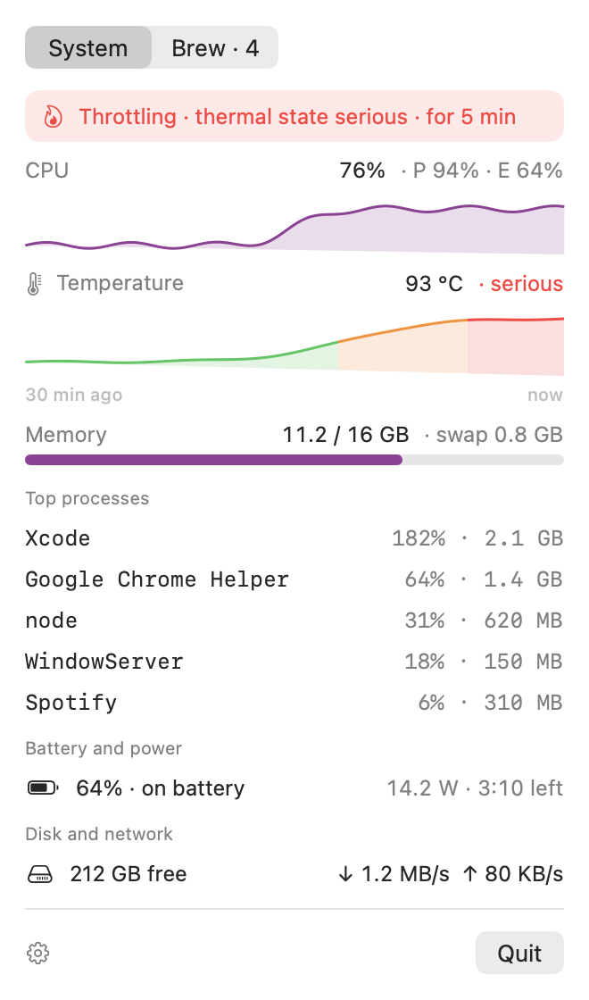
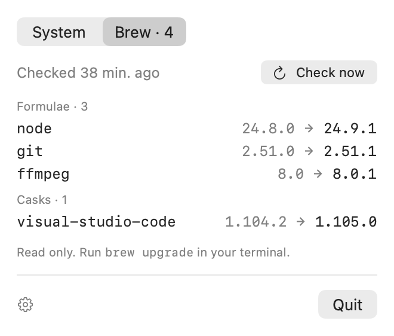
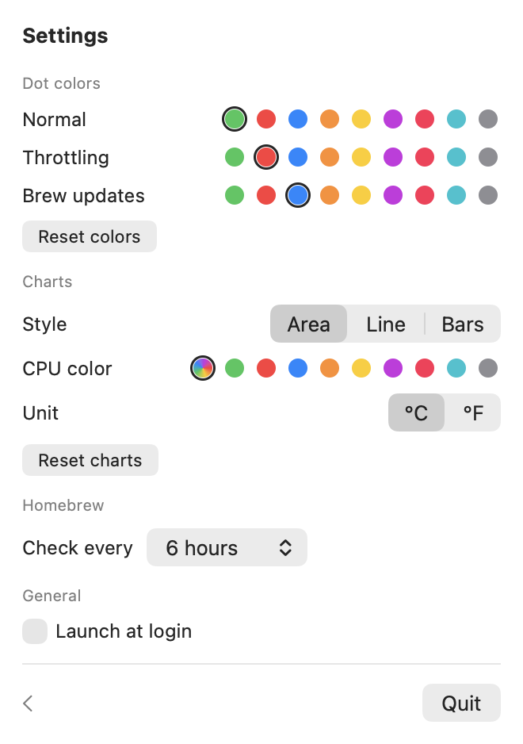
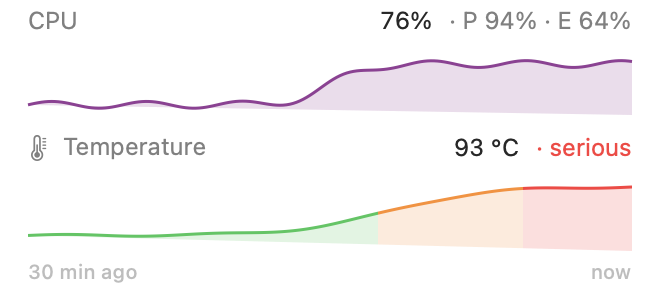
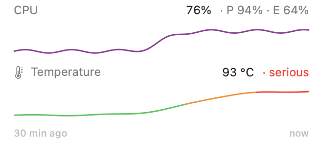

# MacVitals

A small menu bar app for MacBooks, built for fanless Airs. It shows system load, tells you when macOS starts thermal throttling, and lists pending Homebrew updates.

<table>
  <tr>
    <td align="center" valign="top">
      <picture>
        <source media="(prefers-color-scheme: dark)" srcset="docs/screenshots/system-dark.png">
        
      </picture>
    </td>
    <td align="center" valign="top">
      <picture>
        <source media="(prefers-color-scheme: dark)" srcset="docs/screenshots/brew-dark.png">
        
      </picture>
    </td>
    <td align="center" valign="top">
      <picture>
        <source media="(prefers-color-scheme: dark)" srcset="docs/screenshots/settings-dark.png">
        
      </picture>
    </td>
  </tr>
  <tr>
    <td align="center">System</td>
    <td align="center">Brew</td>
    <td align="center">Settings</td>
  </tr>
</table>

<sub>Screenshots use demo data, rendered with <code>--snapshot docs/screenshots --demo</code>.</sub>

## Requirements

- macOS 14 (Sonoma) or newer
- Apple Silicon. Intel Macs work too, but the CPU line shows a meaningless "E 0%" and the thermal state shows as a colored band instead of a temperature chart.
- The Command Line Tools (`xcode-select --install`). You don't need Xcode.
- [Homebrew](https://brew.sh) for the Brew tab. Without it, the tab shows a message and the rest of the app works normally.

## Install

```bash
git clone https://github.com/Ty-ln/MacVitals.git
cd MacVitals
./build.sh
open ~/Applications/MacVitals.app
```

`build.sh` compiles a release build, wraps it in `MacVitals.app`, signs it ad hoc, and installs it to `~/Applications`. If MacVitals is already running, the script quits it first.

The app has no Dock icon. Look for the colored dots in the menu bar. To start it automatically, open Settings (gear icon) and turn on **Launch at login**. If macOS asks, approve it in System Settings › General › Login Items.

If you copy a built `MacVitals.app` to another Mac instead of building it there, Gatekeeper blocks it on first launch because it isn't notarized. Right-click the app and choose Open once to allow it.

## Usage

### Menu bar dots

| Menu bar | Meaning |
| --- | --- |
|  | Normal |
|  | Throttling: macOS is limiting performance because the Mac is too hot |
|  | Homebrew updates are pending |
|  | Throttling and Homebrew updates pending |

The colors can be changed in Settings.

### Dashboard

Click the dots to open the dashboard.

- **System:**
  - CPU load, split into performance and efficiency cores
  - a 30-minute history: CPU load above chip temperature, on the same time axis. The temperature chart is colored by the thermal state (green, amber, red), so you can see which load heated the Mac and when macOS started throttling.
  - memory used and swap
  - the top five processes
  - battery and power draw
  - free disk space and network throughput
- **Banner:** when the Mac runs warm, an amber banner appears; when it throttles, a red one.
- **Brew:**
  - outdated formulae and casks, with the installed and latest versions
  - "Check now" to refresh
  - The tab is read only. Run `brew upgrade` in your terminal to update.
- **Settings** (gear icon):
  - dot colors
  - chart style (area, line or bars), the CPU chart color, and °C or °F
  - how often to check Homebrew (1–24 hours, 6 by default)
  - launch at login

### Chart styles

Pick a style in Settings › Charts. It applies to both charts. Area is the default.

<table>
  <tr>
    <td align="center" valign="top">
      <picture>
        <source media="(prefers-color-scheme: dark)" srcset="docs/screenshots/chart-styles/area-dark.png">
        
      </picture>
    </td>
    <td align="center" valign="top">
      <picture>
        <source media="(prefers-color-scheme: dark)" srcset="docs/screenshots/chart-styles/line-dark.png">
        
      </picture>
    </td>
    <td align="center" valign="top">
      <picture>
        <source media="(prefers-color-scheme: dark)" srcset="docs/screenshots/chart-styles/bars-dark.png">
        
      </picture>
    </td>
  </tr>
  <tr>
    <td align="center">Area</td>
    <td align="center">Line</td>
    <td align="center">Bars</td>
  </tr>
</table>

## Update

```bash
cd MacVitals
git pull
./build.sh
open ~/Applications/MacVitals.app
```

## Uninstall

```bash
~/Applications/MacVitals.app/Contents/MacOS/MacVitals --login-item off
pkill -x MacVitals
rm -rf ~/Applications/MacVitals.app
defaults delete io.github.macvitals
```

The last line removes your saved settings.

## How it measures

- **Throttling:** `ProcessInfo.thermalState`, the public signal macOS uses when it limits performance. `serious` and `critical` count as throttling. `fair` shows as amber in the dashboard only. The thermal state colors the temperature chart.
- **CPU:** per-core tick deltas from `host_processor_info`. On Apple Silicon the efficiency cores come first.
- **Temperature:** the hottest of the chip's die sensors (`PMU tdie…`), read through IOKit's HID event system. The chart's scale is fixed at 20–110 °C, so it shows how much headroom is left before throttling.
- **Memory:** app memory + wired + compressed, the same as Activity Monitor's "Memory Used".
- **Brew:** `brew update` + `brew outdated --json=v2`. This runs at launch, on the interval set in Settings, and when you click "Check now".
- **Sampling:** every 10 s in the background and every 2 s while the dashboard is open. The last 30 minutes of CPU and temperature samples are kept for the charts. Top processes are only read while the dashboard is open.

MacVitals needs no root access and no helper tools. Everything uses public APIs or `sysctl`, except temperature: macOS has no public temperature API on Apple Silicon, so MacVitals uses undocumented IOKit functions, as the open-source [Stats](https://github.com/exelban/stats) app does. If a future macOS update breaks them, only the temperature chart disappears.

## Development

```bash
swift build                     # debug build
./build.sh                      # release build, installed to ~/Applications

# Force a thermal state to see the red dot and banner (nominal, fair, serious, critical)
MACVITALS_FAKE_THERMAL=serious ~/Applications/MacVitals.app/Contents/MacOS/MacVitals

# Render both tabs, settings, and the dot states to PNGs without opening anything.
# --demo replaces all readings with sample data; this is how the README screenshots are made.
# Add -chartStyle line or -chartStyle bars to render another chart style.
.build/release/MacVitals --snapshot docs/screenshots --demo

# Turn launch at login on or off from the command line
~/Applications/MacVitals.app/Contents/MacOS/MacVitals --login-item on
```

## License

MIT License. See [LICENSE](LICENSE).
